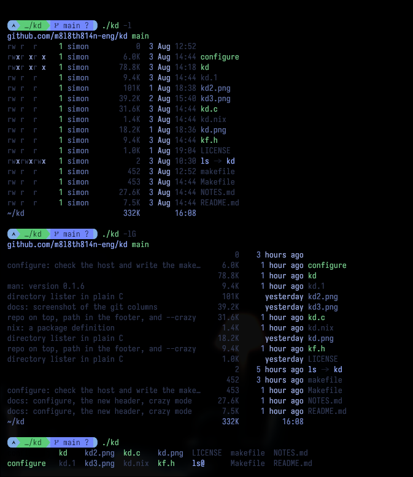
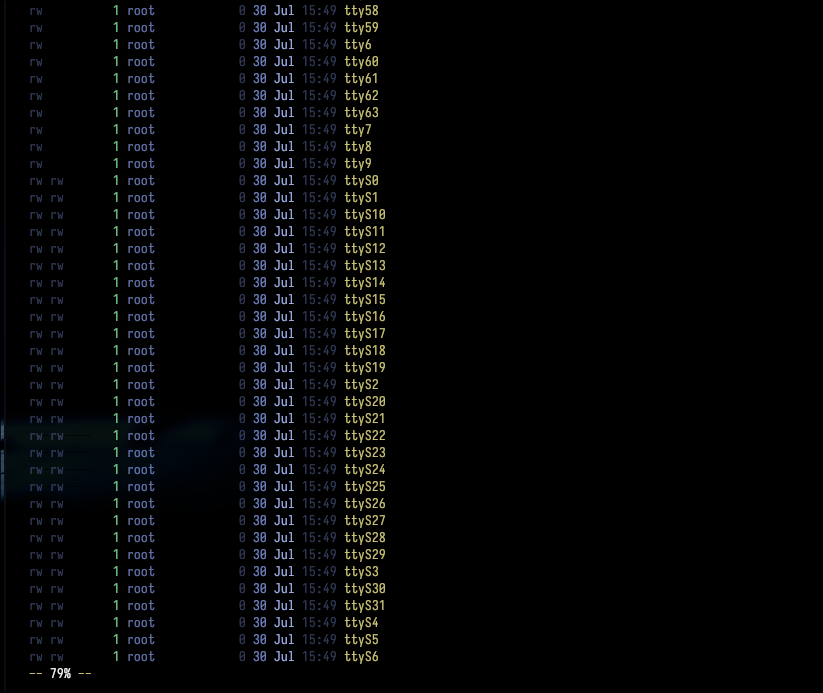
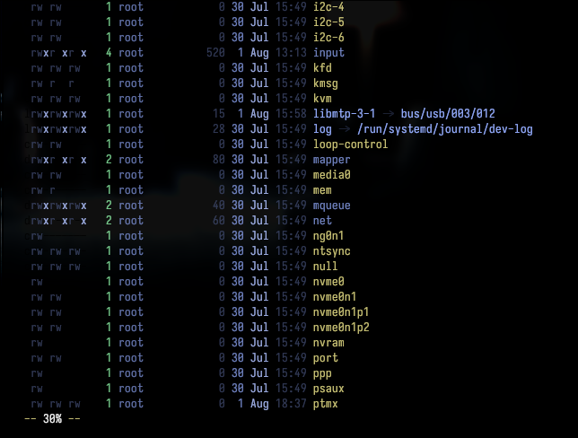

# kd like eza but without mess. get organized.






A directory lister in plain C. No dependencies beyond libc.

It exists to replace `eza` in a set of shell aliases without pulling in a Rust
toolchain, and to be small enough to read in one sitting.

## Build

```sh
make                                  # clang, glibc
make -f Makefile.musl                 # musl, static, host arch
make -f Makefile.musl ARCH=aarch64    # musl, static, arm64
```

Install with either Makefile:

```sh
sudo make install                                   # /usr/local by default
make install DESTDIR="$pkgdir" PREFIX=/usr          # for packaging
alias ls="kd -lG"
alias l="kd -lGa"
alias ll="kd -la"
or
sudo cp kd /bin/ls
```

This installs the binary and the `kd.1` man page. `make uninstall` removes
both.

The musl Makefile picks a toolchain by itself: `musl-gcc` for the host,
`<arch>-linux-musl-gcc` if installed, otherwise `zig cc`, which can
cross-compile against musl without a separate cross toolchain. If none is
found the build stops rather than quietly using the system libc.

## Usage

```sh
kd              # columns, like ls
kd -l           # long
kd -la          # long, including dotfiles
kd -S           # long, without permissions, link count and owner
kd -lG          # long with git status and commit subjects
kd -T           # tree
kd -lW          # long, showing full paths
```

Short flags cluster, so `-laG` works. `-h` is accepted and does nothing —
readable sizes are already the default. `--icons`, `--no-icons` and `--sort`
are accepted and ignored so that aliases copied from eza keep working.

## Behavior worth knowing

**Sizes** are decimal, not binary, and roll up at 1000 — except kilobytes,
which hold until 10000. So 1.5 MB reads as `1500K`, half a gigabyte as `500M`,
and 1.2 GB as `1.2G`.

**Long mode opens with a header row**: where you are, and which repo you are
in.

```
~/kd:github.com/user/kd:main
```

The path is what `pwd` would print, shortened to `~` under your home
directory, in purple, with green colons between the three fields. The remote
is reduced to host, owner and repo, so `git@github.com:user/kd.git` and
`https://github.com/user/kd.git` both read alike. A detached HEAD shows the
short hash as `@8b5b306` instead of a branch name. Outside a work tree the
line is just the path.

When the terminal is too narrow, the line gives up its least useful part
first: the host, then the whole remote, then the branch. The path is never
shortened. This costs one or two `git` invocations per long listing;
`--no-header` skips both.

**`-G` reads like a github listing**: every line opens with the subject of the
last commit that touched the entry.

```
open long listings with a header line     8.6K     1 hour ago kd.1   <- green
directory lister in plain C               101K   19 hours ago kd2.png
                                            18       just now new.txt
```

There is no status column. An entry that `git status` reports as dirty gets
its subject in `KF_GIT_DIRTY` instead of the usual ink, so uncommitted work
shows up as green lines rather than as letters to decode. What that costs is
the kind of change: modified, deleted and renamed all read the same, and an
untracked file has no subject to color, so it looks like anything else never
committed. A leading
`reponame:` is dropped from the subject, since the repo name is already in the
header. A directory shows the last commit touching anything beneath it;
something never committed leaves the subject blank.

`KF_MSG_WIDTH` is a ceiling rather than a fixed width — 45 by default. Before
printing, kd knows the terminal width, the longest name in the listing and the
longest subject in it, and takes the smallest of the three. So the column is
never padded out past the text it holds, and never pushes the size column off
the screen. Subjects that still do not fit are cut with an ellipsis, so the
columns behind it stand still either way. Cramped, it stops shrinking at
`KF_MSG_MIN`; in a directory where nothing has been committed it disappears
altogether.

The timestamp changes meaning under `-G`. Instead of the file's mtime it
shows how long ago the last commit touched it, written the way github writes
it: `just now`, `yesterday`, `3 weeks ago`, `2 years ago`. An entry git knows
nothing about falls back to its mtime in the same phrasing, so the column
always answers the same question. Without `-G` the timestamp is the plain
mtime it has always been.

`-G` also drops permissions, link count and owner, on the grounds that the
subject is worth more than the space it takes. Outside a work tree it does
nothing at all — no empty column, and the permissions stay. That is decided
per directory, so `kd -lG repo /tmp` gives subjects for the one and a normal
long listing for the other; an explicit `-S` still applies to both.

The subjects and their dates come from one `git log` that stops as soon as
every entry has an answer, so this is cheap in an active directory and slower
in one holding a file nobody has touched for thousands of commits.

**`-s` (or `-S`, or `--short`) trims the long format**: no permissions, no
link count, no owner — just size, time and name. It implies `-l`.

**Long mode ends with a summary row**: the total size of everything listed,
under the size column, and the current time under the time column.

**Long mode pages itself** when the listing will not fit on screen. A spinning
character at the right edge of the prompt marks that kd made that decision
rather than you. `-m` forces paging; `--no-pager` disables it. The pager is
built in — neither `less` nor `more` is required — and color survives it,
which it does not when piping to an external pager.

**Symlink targets** are shown only in long mode. Elsewhere a trailing `@`
marks a link, which stays visible when output is piped and color is off.
Unreachable targets are colored differently from reachable ones.

**`.` and `..` are never listed**, matching eza rather than ls.

**Sorting** follows `LC_COLLATE` where the C library supports it. musl has no
collation tables, so a musl build sorts by code point. That matches every
other tool on an Alpine or postmarketOS system.

## Colors

Every color is a macro in `kf.h`, holding the raw SGR parameter — `"34"` is
blue, `"1;33"` bold yellow, an empty string means no color at all. Edit the
header and rebuild; nothing in `kd.c` needs to change.

Colors stay in the base ANSI range, which resolves through the terminal's own
palette, so the active theme decides the actual shades. Fields are separately
addressable: permissions are colored per character, and the date is split into
day, month and time.

Regular files are colored by extension. Extensions are grouped into families —
archives, images, video, audio, documents, source code, structured data,
markup, keys and certificates, and build or backup leftovers — each family a
single macro, so retinting all archives is one edit. The `KF_EXTENSIONS` table
holds the mapping and matches without regard to case, so `.PNG` and `.png`
land alike. File type and the executable bit win first: an executable `.sh` is
colored as an executable, not as source. `--no-ext-colors` turns this off.

`LS_COLORS` is off by default and applies to file names only when enabled with
`--ls-colors`, where it overrides the built-in table for extensions it names.
Metadata columns always come from `kf.h`.

## License

MIT. See `LICENSE`.
